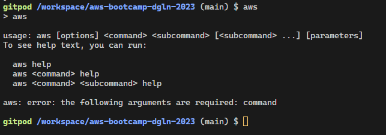
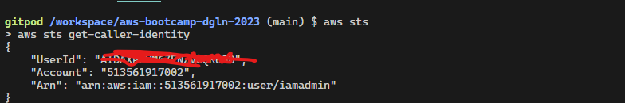
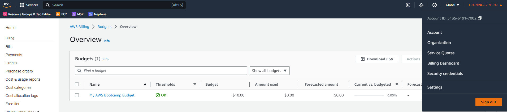
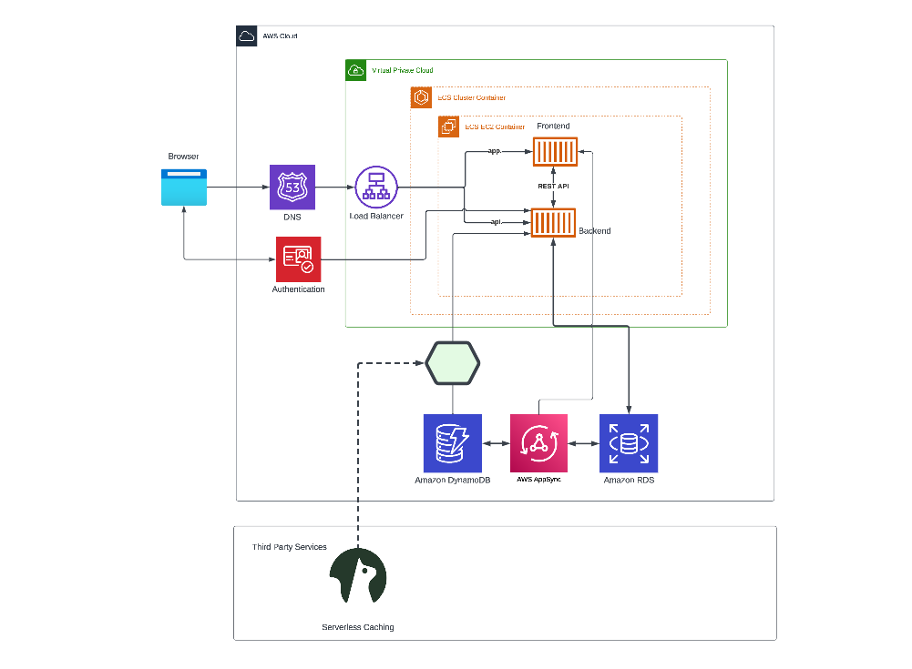
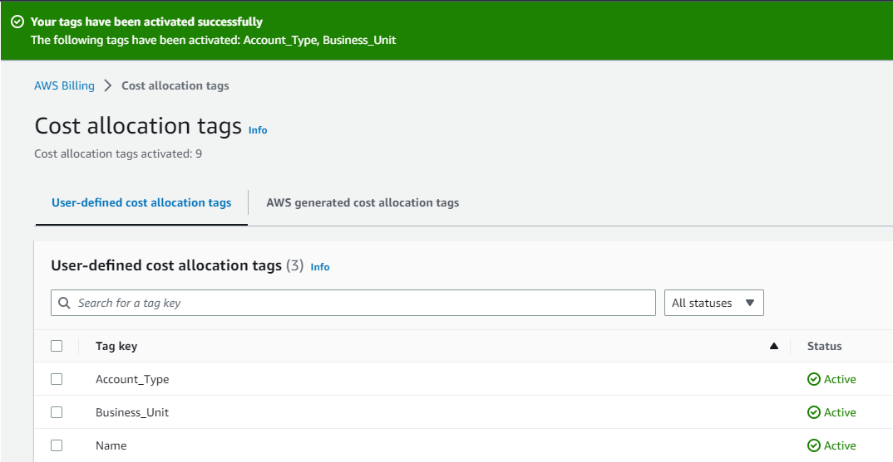
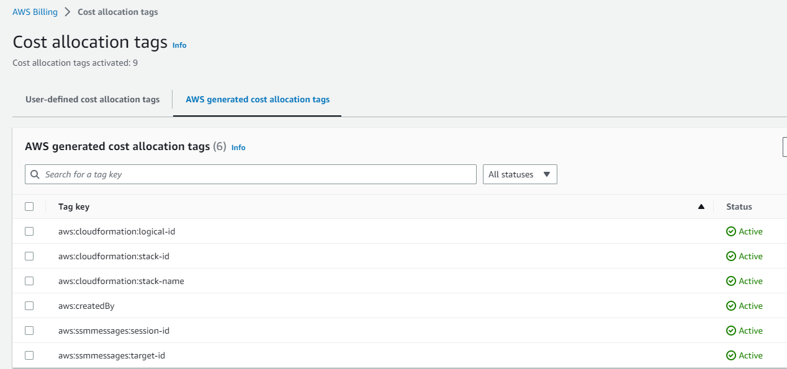
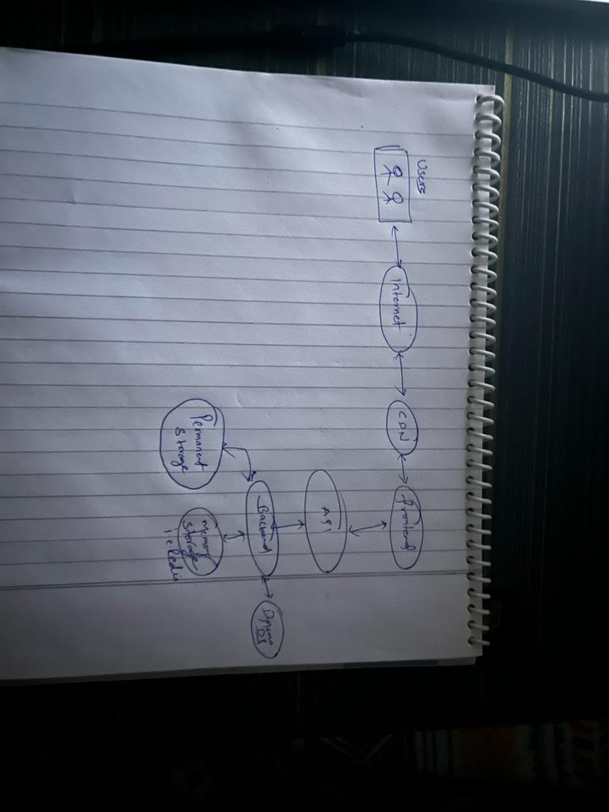

# Week 0 — Billing and Architecture

I was able to setup Gitpod, I have followed your steps which were mentioned in the video and was able to set it up easily.

I also did:

a) understood spend considerations, navigated to aws sections where I can find the spend by services to easily find out which services are costing me.

b) followed security considerations

c) created admin user and used cloudshell

d) Generated admin creds

e) installed aws cli on gitpod

f) created budgets ( attached screenshot below)

## Installed AWS CLI 

## IAM USER

## Create a Budget

## Logical Architectural Design

## Lucid Chart Link

[Lucid Charts Share Link](https://lucid.app/lucidchart/03cd625d-92d8-4e44-a83b-ce711086a3e2/edit?viewport_loc=-3442%2C-932%2C4039%2C2211%2C0_0&invitationId=inv_c6fd0306-c875-4103-9d75-8bf0372bfc45)

## Billing Related Checks

## Napkin Design

